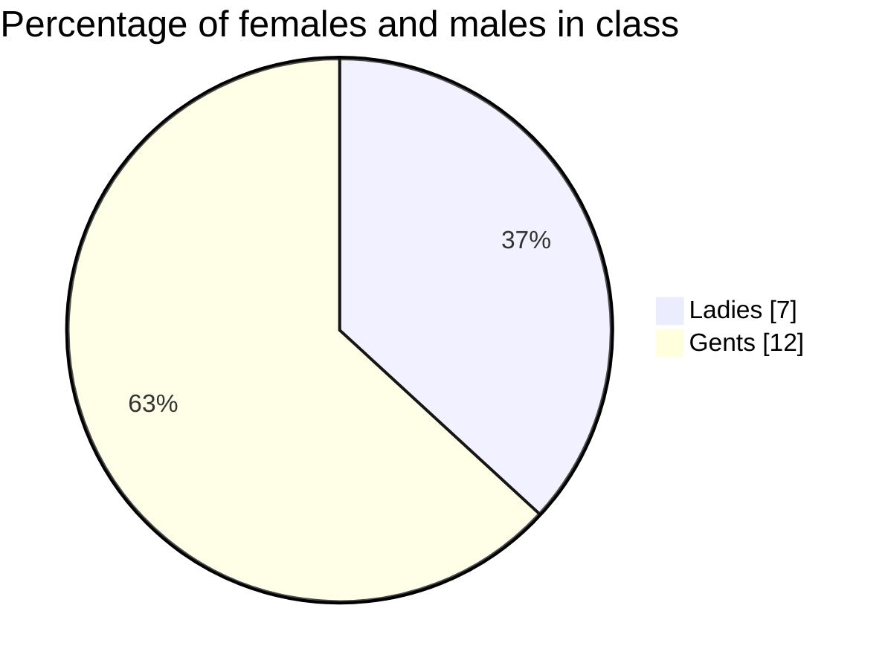

Markdown Practice
==========================
This text will enable you to practice using all of the formatting elements available in the basic version of **Markdown**.

Why Practice?
-----

Remember when you learned **the alphabet**? You didn’t just memorize all 26 letters in one go—with both the [upper- and lower case](https://en.wikipedia.org/wiki/Letter_case) versions and the sounds—instead, you learned a few at a time and used them by finding them on book covers and such and then by reading and spelling them. By actually using them in practice, you cemented your knowledge of them. In other words, learning to read was less a memorization game and more like building a tower of blocks ever higher.


Or like in a complex **video game**. [Modern controllers have as many as 15 buttons and 2 analog sticks](https://www.shortlist.com/lists/history-of-the-video-game-controller), and some games let players use those buttons in seemingly endless combinations to have their characters run, jump, fight, and do hundreds of other actions and chains of actions. But if the game asked players to do all the moves from the first minute, they would get overwhelmed with the steepness of the learning curve and would abandon the game. Thus, savvy game designers construct early levels to use only a few simple, single-button actions at first. As the simple actions become second nature to players, the designers introduce new and more complex ones one at a time so that the player follows a smooth, shallow learning curve that ***maximizes enjoyment and minimizes frustration.***

Markdown isn’t very complicated, but to the newcomer who isn’t already familiar with HTML, it can seem like a lot to remember how to use headings, lists, bold, and the other elements. So it’s important to practice, to smooth out the learning curve as soon as possible.

## Can You Cheat?

Of course you can [cheat](https://en.wikipedia.org/wiki/Cheating#Academic) on this assignment. I can’t stop you. The assignment asked you to type these words out from scratch, but you could copy and paste the text right off the page, and then just add in the Markdown syntax for the **bold** and *italics* and so on, and no one would ever know. If you’re ***clever*** and technically ***minded***, you could take the source html and run it backwards through a Markdown compiler or something and have it do all the work for you in an instant.


But what would be the point? The assignment is pass/fail anyway, and there’s no danger of failing it by doing it wrong since you won’t be graded on achievement but instead on effort. And when you think about it, grades are meaningless anyway—the only thing that really matters is whether you learn how to use Markdown. Doing so will make you more employable, and it will make the rest of this course easier. And how do you do it? By using it. And this assignment is a good excuse to use it and therefore learn it, so if you do cheat, the only one who will suffer is you, because it’ll take that much longer to complete future class assignments and get good at Markdown. Funny, huh?

Here’s a random block quote

>Never follow anyone else’s path. Unless you’re in the woods and you’re lost and you see a path. Then by all means follow that path.
>—Ellen Degeneres

And here's a bit of code
```
This is a robot speaking. You can tell I'm a robot because my speech looks like it was produced on an old typewriter. Typewriters are the ancestors of robots, so I guess that makes sense. Beep boop.
```
A Section Full of Lists
----
### Grocery List

* milk
* butter
* eggs
* some of those [mint Milano cookies](https://www.pepperidgefarm.com/product/milano-mint-cookies/) I love
* vegetables, I guess?

### To-Do List

1. Finish
1. This
1. Assignment
1. And
1. Then
1. Eat
1. Those
1. Mint Milano cookies

### My Favorite Movies and Why

* Spirited Away (2002)
  1. It's japanese
  1. It makes no sense 
  1. I saw it two days ago in a row in the movie theatre becuase I couldn't stop thinking about it
* Bill and Ted’s Excellent Adventure (1989) 
  1. This was the first “big kid” movie I ever got to see in theatres
  1. Keanu Reeves
  1. Time travel
* Avengers: Endgame (2019)
  1. But not really
  1. You’re just supposed to say that because of what a big deal it was
  1. And it was pretty great, but it’s not, like, my favorite
* [*Alien*](https://www.imdb.com/title/tt0078748/) (1979)
  1. Even though I didn't see this until decades after it came out, somehow the scariest part of the film hadn’t been spoiled for me
  1. So I won’t spoil it for you
  1. But hint: It isn’t the alien
I'm **proud** of *you* for ***getting this far***

Oh, I almost forgot—let’s use at least one horizontal rule

-----------------------

## Top mobiles of 2022 table 

|Place|Company|Model|Price|
|-----|-------|:-----:|-----|
|1|Apple|iPhone 13 Pro Max|1199$|
|2|Samsung|Galaxy S22 Ultra|1199$|
|3|Vivi|X80 Pro|890$|

## Printing Hello world in Java

Some Java code:
```java
public class Hello {
    public static void main(String[] args) {
        System.out.println("Hello, World!");
    }
}
```

## Writing some mathematic formulas

Inline math: $\int_{0}^{\pi} x \, dx$

New line: $$\int_{0}^{\pi} x \, dx$$

## Making a simple pie chart


